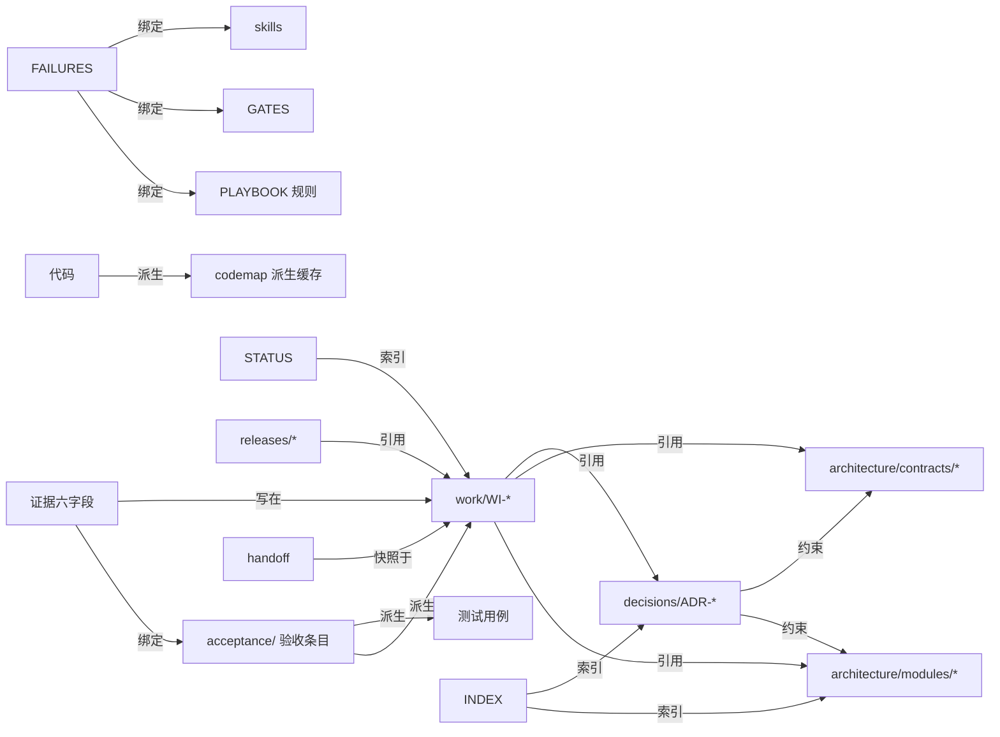

# 01 项目管理标准

候选实现修订见[README](README.md)

适用：由人与 AI 编程工具共同长期开发和维护的大型软件项目（多模块、多会话、可能多人、可能多工具）

---

## 0. 这份标准管什么

管"AI 参与的软件开发过程"，不管代码怎么写。任何时刻、任何工具、任何接手者，都应能只靠仓库答出五个问题：

1. 项目要做什么、本期不做什么——**意图**
2. 现在做到哪了、什么卡着——**状态**
3. 系统为什么这样设计、哪些契约不能动——**架构**（详见 [02](02-项目架构描述规范.md)）
4. 下一个接手的人或工具怎么继续——**接续**
5. 凭什么说做完了、可交付了——**证据**

答不出任何一个，先补工件，再动手。

**"必须"是采用本标准后的最低要求；"建议"按项目选；"参数"是本标准给默认值、项目可改的量。**

本文是候选实现，在本仓库效力为零，不因本轮修订自动生效；采用关系见 [README](README.md)。本轮直接文本审查的矛盾修正见 [M-01 的审查记录](参考资料/M-01-SRE接管与所有权.md#text-review)，不作为外部文章结论。

---

## 1. 十条原则

每条附检查方式——检查不出的原则等于没有。

| # | 原则 | 要求 | 怎么检查 |
|---|---|---|---|
| G1 | 知识随仓库 | 影响后续维护的目标、约束、决策、进度、坑，不得只存在于聊天记录或某人脑子里 | 每次会话结束时问：本次得出的结论里，哪些会影响未来？落到哪个文件了？ |
| G2 | 单一权威 | 同一事实只有一个维护位置；别处引用写链接，不抄值 | 检索同一数值/状态/清单出现两处即缺陷 |
| G3 | 意图、现状、验证分开 | "已批准""已改代码""已验证"分别记录，不混称"完成" | 工作项里三者是三个字段 |
| G4 | 完成需要证据 | 每个完成声明绑定版本、环境、方法、结果、时间 | 证据六字段（§4.2）缺一即声明无效 |
| G5 | 约束可检查 | 高价值规则对应脚本、测试、CI 或明确的人工步骤 | 规则表的"检查方式"列非空 |
| G6 | 变更可追踪 | 契约与架构变更记录原因、影响、替代方案、实施状态 | 高影响变更必有 ADR + 迁移工作项 |
| G7 | 工作可接续 | 中断与交接时保存剩余步骤、阻塞、验证状态、工作区身份 | 接手演练：新会话只读仓库能否继续 |
| G8 | 流程按风险增减 | 小改动轻量；涉及数据、契约、发布时加验证 | 变更分级表（§4.3） |
| G9 | 规则受控演进 | 每条规则绑定失败或风险依据及复审/删除条件；只增不减是缺陷 | 规则登记表两列非空；季度减法有记录 |
| G10 | 入口简短 | 工具入口只放"晚一秒就来不及"的规则与阅读路径 | 入口行数预算（§3.7）；超了先移出 |

**`G` 前缀在本标准里有两个命名空间，引用一律带小节号，两组都不改名**：本节的 G1–G10 是**原则**，属本标准、编号固定；[§5.6](#gates) 的 G1–G8 是**默认闸门**，按该节原文「默认八道（可增删，写在 `GATES.md`）」——闸门 ID 属**项目自己的命名空间**，采用项目可增删改（[示例项目的 `GATES.md`](示例项目-连锁零售中台/governance/GATES.md) 自加了 G9–G13）。看到裸写的 `G5` 先看它在哪一节，不要把两组对号入座。

---

## 2. 三条地基纪律

这三条对一切运行成立，不随项目规模裁剪。它们不成立时，后面全部形同虚设。

### N1 · 三态：通过 / 失败 / 未定

**每个结论都是"结论 + 它的成立条件"。写不出成立条件，记 `UNDETERMINED`（未定）。**

已执行有效检查且明确不满足判据，记 **FAIL**；检查未运行、执行环境故障、超时或证据不足而无法判定，记 **UNDETERMINED**。空输出需结合命令约定、退出码和执行回执判断；没有足够证据不能当作通过。生成者与验证者同一且判断涉及解释、外部写入结果未知、所需授权未获答复、交接缺字段导致无法恢复，均记未定；已验证字段确实缺失的完整性检查可记失败。**"全部 X 通过"在 X 为空集时判未定。**

报告写 `PASS n / FAIL n / UNDETERMINED n`，并同时报告全部预定检查数和判定覆盖率。需要比率时区分“已判定项通过率 = PASS / (PASS + FAIL)”与“全量已证通过比例 = PASS / (PASS + FAIL + UNDETERMINED)”；分母为空记不适用并说明，不能仅报排除了未定的漂亮数字。所有必需项得到足够证据前，不宣布整体通过。

### N2 · 单一权威：副本即缺陷

**每类事实只有一处权威位置。** 版本号、提交号、条数、状态摘要、清单——任何"某处已有权威"的值，在别处写一份便于阅读的投影，它必然漂移。写下任何名单或数字之前，先问：它的权威在哪一处？为什么那一处不够读？

<a id="discipline-n3"></a>

### N3 · 每条规则绑定失败或风险依据与删除条件

**新增规则必须同时写清：它防哪个已观察失败或有依据的风险、什么条件下复审或删除。** 失败绑定观察记录；风险预防绑定一手依据或可复核的分析，写出失效路径、适用对象和待验证假设，不伪造事故或收益。采用前由负责人核对必要性、成本与裁剪条件；依据不足先记候选。说不清防什么的规则容易只增不减；修订作用于判据，不把样例编码进规则。**由单次失败推出的“以后必须……”类规则，采用前对存量对象核对它与现状是否一致**——与存量不符的规则从落笔即错（[M-07](参考资料/M-07-人退到判据上.md)）。登记时另标**依据类型**：补当期工具或模型的能力缺口（替它记住、替它自查、替它拆步骤），还是组织特有的事实与责任边界（验收判据、授权边界、内部系统用法、模块坑）。前者随工具换代进入到期队列（§4.7），后者不因工具变强而复查；分不出类型说明依据没写清，退回补依据（[M-11](参考资料/M-11-脚手架的到期与保值.md)；另一厂商对自家规则文档作同一二分——补模型能力不足的规则随模型变强到期、补运行时上下文不足的规则不到期，见 [M-25](参考资料/M-25-ModelSpec的规则治理方法.md)）。

---

## 3. 文档架构

<a id="doc-tree"></a>

### 3.1 文档树

下面是大型项目的完整形态。**文件存在的理由是"它承载哪条职责"，不是"树里有这一行"**；最小起点是入口、验收、状态三类工件（标 ★）。**一次性对齐工件与长期沉淀工件寿命不同**：动手前用于对齐的方案草稿、探索记录、临时清单属前者，留在 artifacts 或用完即弃，不进文档树、不承担更新义务；只有为下一个改这块代码的人建立心智模型的说明进树并接受 §3.5 的元信息与对账义务。两者混放会让文档树按产出速度膨胀（§7）。小项目可把运行配置和文档地图放进入口，按职责建立一处权威；需要独立维护时再拆为树中的文件，并改用引用。

```text
project/
├─ AGENTS.md                      ★ 工具入口：常驻规则 + 默认加载合同（≤150 行）
├─ CLAUDE.md                        一行 import（Claude Code 读这个名字）
├─ governance/
│  ├─ project.yaml                  项目配置：技术栈、检查命令、路径、兼容策略、预算
│  ├─ GATES.md                      闸门合同：每道门的检查器、通过条件、失败去向、豁免
│  ├─ exceptions.md                 例外登记：规则编号、理由、范围、批准人、到期
│  └─ STANDARD_VERSION              采用的标准版本
├─ .std/                            标准+templates+tools/std 的 subtree 内嵌，版本 = STANDARD_VERSION
├─ docs/
│  ├─ INDEX.md                      文档地图：每份文档的职责、权威域、加载时机（只做地图）
│  ├─ product/
│  │  ├─ vision.md                  目标、用户、非目标、成功判据
│  │  └─ acceptance/              ★ 验收条目，按领域分文件，稳定 ID，可观察结果
│  ├─ architecture/                 见 02：overview / invariants / dependency-rules / modules/ / contracts/
│  ├─ decisions/                    ADR，编号，状态，取代关系；README 是索引
│  ├─ state/
│  │  ├─ STATUS.md                ★ 项目现状：基线、当前重点、阻塞、接手入口（里程碑级）
│  │  ├─ work/                      工作项，一件一文件（实时状态源）
│  │  ├─ handoff/                   会话交接（带身份的临时快照）
│  │  └─ artifacts/                 工具返回原文落点，按引用回读，不进版本控制或只保留索引
│  ├─ knowledge/
│  │  ├─ PLAYBOOK.md                项目特有做法与坑（规则索引，正文可进 skills）
│  │  ├─ FAILURES.md                失败清单：不分区，一条一行
│  │  └─ glossary.md                术语，只放本项目特有的
│  ├─ runbooks/                     故障排查与运维操作，一事一文件
│  └─ releases/                     每个版本：包含的工作项、证据、已知限制、回滚
├─ .agents/skills/<name>/SKILL.md   方法库：按需加载的细则（description 常驻，正文命中才读）
├─ tools/check_*.py                 检查器：每引入一个新失效面配一个
└─ （代码、测试、构建照项目原样）
```

<a id="doc-responsibility"></a>

### 3.2 每份文档的职责卡

写入方表示最终负责角色，授权起草/修改按 §6.1；加载时机是导航提示，实际集合由唯一合同的运行类型视图确定。文件路径可按 §3.1 合并映射，不能据本表生成第二份默认加载清单。

| 文档 | 权威域（它对什么说了算） | 写入方 | 更新触发 | 加载时机 | 它过期了怎么被发现 |
|---|---|---|---|---|---|
| `AGENTS.md` | 常驻规则；默认加载合同；权威位置表；不可逆动作清单；停机条件 | 项目所有者 | 增删必读项；规则被违反且判定为"需要约束不是提醒" | **每次**，整份 | 行数超预算；有一条规则从没被援引过 |
| `governance/project.yaml` | 怎么跑、怎么测、怎么构建；栈与版本；兼容策略；文档布局与篇幅预算；裁剪与派生登记（本卡只给类目，键名由项目的检查器契约定，不在此复制） | 项目所有者 | 命令或栈变化 | 每次（agent 读命令只从这里） | 分域探测：命令类由命令跑不通发现（CI 每天跑一遍）；布局与预算类由检查器报未定或失败发现 |
| `GATES.md` | 每道闸门的合同 | 闸门维护者 | 新增/修改闸门 | 按需 | 闸门放行时无日志（回执对账） |
| `docs/INDEX.md` | **只做地图**：每份文档去哪找 + 一句摘要 + 加载时机 | 项目所有者 | 增删文档 | 每次任务开始 | 指向不存在的路径（linkcheck） |
| `product/vision.md` | 目标、非目标 | 产品负责人 | 阶段变化 | 按需 | 半年未更新且验收条目在增 |
| `product/acceptance/*` | **什么算做完**：每条带稳定 ID 与可观察结果 | 产品负责人（确认即冻结） | 意图变化，留痕不覆盖 | 只加载当前工作项引用的条目 | 工作项引用了不存在的 ID |
| `architecture/*` | 当前有效的设计、模块、依赖、契约、不变量（见 02） | 架构负责人 | ADR 生效；模块增删；契约变更 | 按当前任务涉及的模块 | `source_rev` 落后；依赖检查失败 |
| `decisions/ADR-*` | 为什么这样选、代价、重评条件 | 决策人 | 高影响变更前 | 按需 | 状态 active 但引用的模块已废弃 |
| `state/STATUS.md` | 项目级：基线、当前重点、阻塞、下一优先级 | 项目所有者 | 重点或阶段变化；每次发布 | 按唯一合同的运行类型视图 | `updated_at` 超过两周 |
| `state/work/WI-*` | **单个任务的实时状态**：范围、验收映射、阶段、阻塞、证据、下一原子动作 | 执行方写，负责人核 | 每次状态转换；每次会话结束 | 当前工作项 | 状态 `in_progress` 超 N 天无转换记录（活性巡检） |
| `state/handoff/*` | 某一时刻的恢复凭据 | 上一次运行的执行方 | 会话结束、压缩前 | 新会话第一读 | 缺工作区身份；HEAD 与当前不符 |
| `knowledge/PLAYBOOK.md` | 项目特有的做法与坑，每条绑失败或风险依据及复审/删除条件 | 具名负责人，授权编辑见 §6.1 | 新增规则；规则被判不可执行 | 按触发条件 | 条目只增不减；某条长期无消费 |
| `knowledge/FAILURES.md` | 已观察到的失败，不混入假设风险 | 具名负责人，授权编辑见 §6.1 | 每次观察到失败 | 做删减、审计、补绑定时 | 抽样核对实际失败是否漏记；长期不增只触发调查 |
| `runbooks/*` | 故障怎么排、操作怎么做 | 事故处理人 | 事故复盘后 | 出故障时 | 引用的命令跑不通 |
| `releases/*` | 某版本包含什么、证据、已知限制、回滚 | 发布人 | 每次发布 | 回溯时 | — |
| `.agents/skills/*` | 某类任务的细则 | 具名负责人，授权编辑见 §6.1 | 规则细化；坑沉淀 | 简介可发现，命中才读正文；宿主能力须核验 | 长期无消费 |
| `tools/check_*` | 机械判定 | 维护者 | 新失效面出现 | CI / 提交前 | 四步验收（§5.6）；反例测试失败 |

**仓库外的约束**：工具账号级配置（个人规则、跨会话记忆）与平台侧下发的团队规则不随仓库走，接手者和另一个工具读不到。影响产出正确性或可维护性的约束必须在仓库有权威位置（G1）；工具侧只放个人偏好，或该权威的投影并标明来源。多项目共用的团队级规则，权威在一处，项目内的副本按 §3.4 的派生关系带来源版本并机械对账，不在项目内单方面改；项目特有的规则写在项目内，并注明它为什么不上收。项目无仓库外规则源时本段不适用。依据见 [M-06](参考资料/M-06-团队级规范的权威与同步.md)。

### 3.3 三层结构与阅读路径

```
入口层   AGENTS.md ─── INDEX.md ─── STATUS.md          按唯一合同的运行类型视图加载
主题层   acceptance/  architecture/overview  decisions/README  PLAYBOOK  当前任务涉及的才看
对象层   modules/<m>  contracts/<c>  work/WI-*  runbooks/RB-*  ADR-*  精确到文件与片段
```

**标准阅读路径**：`AGENTS.md` → `STATUS.md`（当前重点）→ 当前 `WI-*`（它的上下文清单说本次读什么）→ 清单里列的模块文档、契约、ADR、验收条目 → 代码。**不从 INDEX 往下全展开；INDEX 是地图，不是目录树遍历的起点。** 详细规则在 [03](03-Agent信息获取与上下文管理.md)。

### 3.4 文档之间的关系

只有四种关系，每种有各自的核对方式：

| 关系 | 含义 | 例 | 怎么核对 |
|---|---|---|---|
| **派生** | B 由 A 机械生成，B 记录 A 的版本 | 代码地图 ← 代码；测试 ← 验收条目 | B 头部 `source_rev`；CI 重建 + diff。派生文档不得混入人工内容，人工补充另置一文件由引用关联——否则重建覆盖它，或对账恒不为零而被关掉 |
| **引用** | B 链接 A，不复制 A 的内容 | 工作项 → 模块文档、契约、ADR | linkcheck；引用处不出现被引内容的数值 |
| **绑定** | B 用稳定 ID 回指 A 的一条 | 证据 → 验收 ID；规则 → 失败/风险记录 ID；工作项 → 验收 ID | ID 存在性检查 |
| **索引** | B 只列 A 的位置与一句摘要 | INDEX → 全部文档；STATUS → 当前工作项；ADR README → ADR | 索引与细节冲突时**以细节为准**，索引失配可检测 |



**禁止的关系**：文档 A 复制文档 B 的一段（应引用）；两份文档对同一事实各自维护（应指定主从）；模型专用摘要与人读版本分离（人看不懂的副本没人维护）。

### 3.5 文档元信息与状态

重要文档（验收、架构、模块、契约、ADR、runbook）头部带：

```yaml
id: MOD-inventory          # 稳定 ID
status: active             # draft | active | superseded | retired
owner: 具名到人或角色
updated_at: 2026-08-25
supersedes: []             # 取代了谁
source_rev: a3f9c21        # 仅派生文档：它对账的源版本
review_at: 2026-11-25      # 可选：到期复核日
```

- `draft` 不产生约束；`active` 是当前有效；`superseded` 保留并指向替代者；`retired` 只留追溯。
- **日期较新或标题写着"终稿"，不自动意味着已取代其他文档**；取代关系只由 `supersedes` 字段表达。
- 涉及实施的文档另行关联工作项与证据；**不用文档状态代替实施状态**（G3）。

<a id="conflict"></a>

### 3.6 冲突处理

文档之间、文档与代码之间冲突时，按序：① 检查各自的适用范围与状态；② 检查明确的 `supersedes`；③ 都没有则**登记冲突**（写进 FAILURES 或工作项的阻塞项），列出互相冲突的主张与各自的范围、版本、环境，**不静默挑一个**；④ 需要负责人裁的部分等待，其他独立工作继续。**代码与文档不符时不自动以代码为准**——代码可能是错的实现，文档可能是过期的意图，谁对由主张的归属人裁。

**规则之间的张力不会以报错形式出现**：执行者（人或模型）会静默择一，并给自己一个看似合理的跳过理由，冲突因此进不了上面的登记流程。所以每条规则写明适用范围与例外，冲突在写入那一刻消除，不留给读者推理（[M-09](参考资料/M-09-规则膨胀的机制.md)；规则文档应让分歧具体而不是用讨喜措辞掩盖，见 [M-25](参考资料/M-25-ModelSpec的规则治理方法.md)）。

<a id="budget"></a>

### 3.7 篇幅预算（参数，给默认值）

| 文档 | 默认上限 | 超了怎么办 |
|---|---|---|
| `AGENTS.md` | 150 行 | 细则移进 skills；权威位置表之外的一切表格移出 |
| `INDEX.md` | 每份文档一行 | 不写摘要以外的内容 |
| `STATUS.md` | 80 行 | 完成的移出"当前重点"；历史进 releases |
| 工作项 | 150 行 | 过程记录移进 artifacts，只留结论与指针 |
| 交接 | 60 行 | 只留当前判断所需 |
| 模块文档 | 200 行 | 拆出契约与 runbook；"已知坑"移进 PLAYBOOK |

由失败驱动的规则修订，尤其是自动生成的，天然选择追加而不是合并：不碰已有条款最安全，全局扫描又超出单次修订的预算。因此**在同一次修订里核对预算与既有同义条款**——先查有没有已经说过同一件事，有就合并到那一处，没有再新增；同一条款的文本出现在两处以上按 N2 判缺陷，处置是合并，不是再强调一遍（执行点的冗余不同，见 [§4.7](#maintenance-budget)）。**合并或改写一条规则的文本即改动了它与所绑失败或风险的绑定关系**：该规则的具名负责人在同一次修订里重放其绑定的失败或风险反例（做法同 §4.7 的到期审计），确认改写后仍覆盖原依据；反例不可重放时按 N1 记未定，该次合并不作完成，绑定关系照原样保留（[M-20](参考资料/M-20-规则改写与绑定依据的重放.md)）。

表中数字仅是便于起步的项目试验参数，不是通用安全线或合格门槛。按 [03 的预算与评估](03-Agent信息获取与上下文管理.md#measurement)测量任务质量、遗漏与总成本后调整；不按行数推定 token 占用，也不能为满足篇幅删除必要约束。

<a id="multi-repo-artifacts"></a>

### 3.8 多仓系统的工件分布

一个系统跨越两个以上代码仓库时，§3.1 那棵树不能每个仓各长一棵。**默认结果是每个仓各有一份入口和一套文档；本节要求这件事成为一次被记录的决定，而不是默认。** 架构侧的跨仓规则（代码位置边界、改动顺序与回退边界、共享命名空间、公共能力清单入口）见 [02 §2.2](02-项目架构描述规范.md#runtime-deployment) 与 [§4](02-项目架构描述规范.md#dependency-rules)，本节只管文档与管理工件放哪。单仓项目记不适用。

- **指定一个承载系统级工件的仓**。跨仓才成立的事实——产品意图与验收条目、系统全景、跨仓契约登记、决策历史、系统级状态与工作项——在整个系统里只有一处权威，放在该仓。它叫什么、有没有应用代码，由项目自己定。触发：系统跨越第二个代码仓；新增或退役一个仓。责任：项目所有者。验收：任取一条系统级事实，能说出它的唯一维护位置。
- **归属判据**：一条事实放哪个仓，按"改这条事实时会同时改哪几个仓"决定——同时影响多仓的放系统仓，只影响一仓的放该仓。判不准的先放系统仓并标注待定，不两边各放一份。失败处置：出现第二处文本按 N2 判缺陷，处置是合并到权威处、别处改指针；**为维持两份一致而新建的同步机制（同步脚本、镜像检查、定期对齐）本身按 [§4.7](#maintenance-budget) 登记为待删对象**，不作为合规证据。
- **各仓入口是投影不是副本**。每个仓必须有自己的入口文件，内容只有两类：本仓特有的约束，以及系统级权威在哪。系统级规则正文不抄进来。验收：从任一仓的入口出发，两跳内到达系统级权威，并能读出系统由哪几个仓组成、各自状态。
- **跨仓引用按契约处理**。一个仓的文档指向另一个仓的路径时，该路径是契约：移动前先改全部引用方，或保留指向新位置的指针。触发：目录重组、仓库合并或拆分。验收：跨仓链接可机械检查。
- **每个仓的状态在系统级入口登记**：`active` / `retired`（不再接受改动，历史保留）/ `archived`（已移出工作区，只在远端）。**退役仓在停止使用的同一次变更里，其入口与规则文件必须被标为失效或删除**——退役不是"不再提交"，是"不再被读"。失败处置：退役仓保留着可被读入的规则时，其状态按 N1 记未定，不因"没人在那儿干活了"推定无害。复查：仓的状态变化时。
- **退役还要停掉会自动执行的东西**。上一条管的是“会被读的”；退役仓里**不经人触发就会跑起来的面**——会话钩子配置、已安装的版本控制钩子、CI/流水线配置、定时任务与安装/升级/校验脚本——**贴失效标记不算处置**，必须删除、清空或使其调不起来（脚本连同调用入口一并移除，钩子配置清空，流水线删除或停用）。触发：一个仓转入 `retired` / `archived`。责任：退役该仓的执行者提交处置清单，系统级工件承载仓的所有者核对。验收：在该仓目录里起一次全新会话，钩子不触发；仓内不存在仍会被自动调起的脚本或流水线；核对留一行回执（仓名、处置对象、核对人、日期）。失败处置：可执行面未处置的，该仓的退役状态按 N1 记未定，不因文档已贴失效头推定完成。**核对的执行点是上述具名角色的人工核**（§1 G5 的“明确的人工步骤”）——现有跨仓检查器的退役判据只读规则文件开头的失效标记，看不到可执行面，**它的 PASS 不构成本条的证据**。复查：该判据扩展到可执行面时，本条改为核检查器输出。
- **上一条的失败依据**（2026-09-10，本标准集自身的一次采用，细节见 [M-26](参考资料/M-26-多仓系统的工件分布观察.md)）：给一个真实退役仓的规则文件逐份加上失效头后，跨仓检查器的退役判据当即由 FAIL 翻成 PASS；而该仓 `.claude/settings.json` 里的会话启动钩子与 pre-tool-use 钩子仍然装着、`.harness/scripts/` 下的校验与安装脚本全部在位，在那个目录里起一次会话它们照样触发。按 [§5.5](#controlled-actions) 同一判据——文档里的失效头是提醒，钩子才是执行点——当时给退役仓装的只是提醒，检查器却报了 PASS。
- **已观察的风险依据**（[M-26](参考资料/M-26-多仓系统的工件分布观察.md)，一次真实项目的只读测绘）：一个四仓系统中，控制平面仓与拆分前的老仓有 1614 个同名文档文件；老仓保留完整规则集，其内容描述的工作方式已于三周前被移除，与现行规则直接冲突；而系统级入口未列出该仓。**两个方向同时失效**——从入口出发发现不了它，在它目录里起会话则把过期规则当现行规则读入，中间没有任何检查。该系统同时提供了正面佐证：它已把跨仓文档路径明确写为契约，移动须同步改引用方。

---

## 4. 日常管理

<a id="work-item-lifecycle"></a>

### 4.1 工作项生命周期

一套状态机，一个完成定义。每个状态写清进入依据与**必需工件**——工件缺失即不得进入。

轻量变更可按 §4.3 免建独立工作项文件，以 PR/提交说明承载简记：目标与范围、风险级别、验证依据与结果、遗留项；后文“工作项”读取、更新和引用义务可由该简记承担。任务升级为常规或需要跨会话接续时，补建工作项并关联简记。验收无需强造 ID，但必须有可观察判据。

| 状态 | 进入依据 | 必需工件 |
|---|---|---|
| `planned` | 目标与范围足以开工 | 工作项文件：目标、范围内/外、引用的验收 ID、变更级别、上下文清单；**本次输入清单**，每项归到范围内条目或显式记为范围外 |
| `in_progress` | 已开始修改或调查 | 工作区身份（仓库/分支/提交）；影响清单（常规及以上） |
| `blocked` | 依赖条件不足 | 缺失条件、影响、解除方式、责任人、复查时间。**阻塞是显式标记，不是乐观的完成态** |
| `in_validation` | 已有可检查结果 | 验证计划（从改动集派生的可观察终点）；闸门记录 |
| `done` | 验收条件满足 | 证据六字段逐条绑验收 ID；相关文档已同步；已知限制已写 |
| `cancelled` | 明确不再做 | 原因；已有工作的处理 |

规则：`blocked` 解除回到适当状态；验证失败回 `in_progress`；`done` 后发现验收不成立可重开并记原因。**`done` 不代表已合并、已部署、已发布**——这三个另记在发布记录里。每次转换在工作项里留一行：`from → to | 时间 | 执行者 | 工作区身份 | 依据（闸门/证据）| 三态`。**时间尽量取自可回读事件**（提交、流水线运行、闸门回执、评审记录、发布记录）；只有人工或模型自报、无事件佐证的转换标注来源，据其计算的阶段耗时与等待时长按 N1 记未定，不进入 §4.8 报表当已判定值。补事件来源后转为已判定。

**状态的读写权分离**：活性巡检与自动编排只读工作项状态，只做调度、重试与对账；状态转换由执行者在流程内写并留上面那一行。编排层自己的认领、运行、重试记录是调度状态，不是工作项状态，两者不互相代写；编排层重启后以工作项状态重建调度状态，反向用调度状态改写工作项状态按 N2 判缺陷（[M-23](参考资料/M-23-问题跟踪器作控制面与状态写入权.md)）。

活性：任一未终结状态停留超过其约定的复查时间即触发核实——`in_progress` 超过 N 天（参数，默认 5）无进度证据、`planned` 长期未开工、`blocked` 过复查时间未复查、`in_validation` 长期等待验证或评审。处于活跃状态却没有任何执行者在运行、以及工作项已终结或转为不活跃而执行者仍在运行，同属巡检对象，停止与重建按 [04 §6.5](04-可靠性安全与运行维护.md#unattended-operation)，本节只定巡检对象（[M-23](参考资料/M-23-问题跟踪器作控制面与状态写入权.md)）。等待多数发生在状态之间，只巡检执行中的工作项会漏掉停滞（[M-05](参考资料/M-05-交付周期中的组织摩擦.md)）。巡检通知负责人核实；确有依赖缺失才转 `blocked`，仍在推进则补进度与下次检查时间，范围过大则拆分。不得为避开超龄而空转状态或重建 ID 清零年龄。

<a id="session-protocol"></a>

### 4.2 一次会话的协议

**开工前**（答不出就停，先补工件；详细加载规则见 [03 §3](03-Agent信息获取与上下文管理.md)）：

1. 声明本次运行类型：**交付型**（出口是验收）还是**事实型**（出口是一份带成立条件的事实 + 待裁项，不是变更）；**从头**还是**接手**。
2. 八问：① 当前工作项与其状态版本 ② 仓库/分支/提交/未提交改动 ③ 交付型还是事实型 ④ 从头还是接手 ⑤ 本次可触范围 ⑥ 本次禁止的动作 ⑦ 完成判据是哪几个验收 ID ⑧ 上次遗留项。
3. 核对**实际对象**与**上游对它的描述**：对象不限于代码，描述不限于工作项——口述稿、方案、上一环的报告同属描述。**引用的每条上游事实标注它是自核还是转述**：自核给出可复算的方式（命令、文件行号或原文摘录），转述给出来源；只由转述支撑的判断按 N1 记未定，不记通过。有差异先登记，先纠正转述再往下走，不在错误前提上继续。**不得未经判断覆盖别人留下的修改。** 执行点是本次开工或接手的执行者的人工核（§1 G5 的“明确的人工步骤”）。已观察失败：一份口述稿里五处事实与实物不符——某脚本的 `guard-rm` 处数报 8 实为 12（同名 `.ps1` 另有 11 处，稿里未提）、称“同理”的另一脚本实为 0 处、称两份备份不带失效标记而它们早就带了、称已标失效的目录实为生成物（源头未标，同步一次即覆盖回去）、一句“只留一行指针”照抄会当场造出一条不合规（[M-27](参考资料/M-27-输入里的实际状态与转述.md)）。
4. 接手时多做一步：对交接里每个"必读"项问"它上次被写是什么时候、上次被读是什么时候"，答不出的记未定。

**上面第 3 条与 §4.4 独立性判据共用四类出口。** 单次核不动（远端仓、已销毁环境、第三方系统、只剩归档快照）记未定并写明为什么核不动，不记不适用——不适用是确定结论，这里没有结论。**人的意图、授权与验收判定不适用本条**：用户原话、冻结的验收条目、决策日志里的裁决没有下一层实物可核，转述就是对象本身，去“核实”一条人的决定是越权不是尽责（§6 开头“人保留的是判据与取舍”；[M-19](参考资料/M-19-多执行者协作中人的位置.md)）。**去核不得越过 [§5.5](#controlled-actions) 的授权边界**，越不过的记未定，不为核一条事实触发未授权的受控动作。**转述已附可复算的原始证据时（收工前六字段②要求的命令与完整输出），读那份证据即视同已核**，不必重跑；缺这一档本条就退化成“什么都要复核一遍”。**第四类以判据集未变为前提**：证据由检查器或判据集产出的，只对产出时那一版成立；引用前核对它钉住的身份，判据集已变而未按当前判据重放的按 N1 记未定，不因“附了命令与输出”视同已核（[M-27](参考资料/M-27-输入里的实际状态与转述.md) 四类出口一节）。

**执行中**：

- 简单修改直接做，在工作项里留一句。
- 跨模块、接口、数据变更先写影响清单、实施顺序、验证方式，再动手。
- 遇到阻塞记缺少的条件，不把"等待某个条件"写成"已完成"。
- 新发现但不属于本次目标的问题登记为新工作项，不就地扩大范围。
- **范围两侧都对账**：输入清单里归不上任何条目的项，或是收料误纳（从清单去掉），或是条目遗漏（新增一项），不留“参考”类未归项；范围内每条实施项须能指到具体出处（文档原句、图上标注、用户原话之一），以“一致性”“同类功能应该也……”推出的条目不实施，登记为待确认。用领域知识扩展检索候选不受此限，它只缩小查找范围，不进交付物（[M-12](参考资料/M-12-输入归宿与落盘证据.md)）。
- 受控动作核对已有用户授权；具体边界与超范围处理见 §5.5。
- **停机条件**，命中任一即停下受影响动作并报告：同一故障连续两次修复无效且无新证据（重试前必须改变一个输入变量并写下改了什么）；超出第 ⑤ 项范围；受控动作缺授权；未定挡在完成判据上；连续三次工具调用失败；**发现通过弱化断言、跳过失败路径或偷改预期来掩盖缺陷**。合理修测试按 §5.2 处理。报告已知事实、未知与下一步，独立工作可继续。

**收工前**：

1. **证据六字段**，每个完成声明后面跟一段，缺一项声明无效：① 断言（具体说了什么）② 原始证据（命令 + 完整输出，或 CI 链接；不许只写结论）。**证据取自落盘工件或可重读的状态变化**；可能被截断、置后台或异步化的输出通道不单独作为成功或失败判据（[M-12](参考资料/M-12-输入归宿与落盘证据.md)）③ 版本与工作区身份 ④ 适用范围——**声明“跨越某个边界后仍成立”时（重启、新进程、新会话、换环境、换工具），证据须在越过该边界之后采集；边界之前的中间信号（已提交、已写入、已缓存）不证明越界后成立**（[M-18](参考资料/M-18-跨边界的验收观察.md)）⑤ 观察时间 ⑥ 确认方法。**当时没记，事后补不出来。**
2. 更新工作项：状态、转换记录、下一原子动作、最后验证时间。
3. 写交接（会话结束与上下文压缩同等对待）：短交接进窗口，完整产物按引用回源。字段见示例项目的交接文件。
4. 沉淀候选：本次发现的"只有本项目知道的事"写进工作项的候选区，由人在周维护时决定进不进 PLAYBOOK。**模型自己的推断不作候选，只有人的输入和可定位的观察才算。** 须有明确重复信号（重复劳动、反复纠正、反复找同一上下文、已有规则的缺口）才产出候选，一次任务至多一项，无信号不产出。**沉淀分级不跳级**：先只记录；同一路径重复出现再写成做法（PLAYBOOK 或 runbook）；步骤稳定且高频再做成技能或脚本；能机械判定且失败后不应继续的，最后下沉为闸门（§5.6）。依据见 [M-08](参考资料/M-08-规则的增补与打薄信号.md)。
5. 影响项目整体认知的，同步 STATUS、架构或决策记录。

<a id="change-level"></a>

### 4.3 变更分级

| 级别 | 例子 | 必需工件与验证 | 谁可以放行 |
|---|---|---|---|
| **轻量** | 文案、样式、日志措辞、注释、行为明确的一行修复 | 工作项可省，提交信息写明；跑相关测试 | 执行者本人 |
| **常规** | 新功能、模块内重构、一般缺陷修复、新增测试 | 工作项 + 影响清单 + 相关测试 + 文档同步 + 证据六字段；闸门 G1–G8 | 验证者（≠生产者） |
| **高影响** | 数据迁移、契约变更、跨模块依赖变化、核心架构调整、权限模型、首次上线或扩大风险边界的生产发布、依赖大版本升级 | 以上全部 + ADR + 分阶段计划（见 02 §5.4）+ 兼容与恢复策略 + 针对关键风险的专项验证 + 人的确认 | 负责人具名批准 |

**不以修改行数判断风险。** 一行改动碰到契约就是高影响；三百行的新页面可能只是常规；面向模型的提示或规则文本同理，一行改动可改变全部产出的行为，且可能只在更宽的评测集上才显形（[M-24](参考资料/M-24-三处退化叠加与内部试用构建.md)）。级别由执行者提出、由能对该工件负责的人确认；**执行者为 agent 时不得自评为轻量并自行放行**——否则表中“执行者本人”一格即自评自放，与 §4.4 的结构要求矛盾（[M-13](参考资料/M-13-执行点冗余与自评级.md)）。

常规部署沿用已批准策略、作用域和恢复路径时，可引用原 ADR 与适用授权，不因“又部署一次”重建同一决策；代码/数据变化仍按其实际风险分级，生产写入仍核对 §5.5 授权。

<a id="review-flow"></a>

### 4.4 评审与合并

- 每个 PR/合并请求必含：工作项及验收 ID、证据六字段（或其指针）、变更级别；轻量项用 §4.1 简记承载判据和验证记录，不要求不存在的 ID。
- **生产者 ≠ 验证者是结构要求**：多人项目至少一名他人评审、不自合；单人项目在独立会话里只挂产出物与验收标准做审查，不读生产会话的推理。独立性的判据是**检查的触发源与被验对象之间没有因果关系**；复述上一环结论、或复述上一环**对对象状态的转述**，都不计为独立证据——评审结论里引用的每条上游事实同样标注自核还是转述，标注办法与四类出口见 §4.2 开工前第 3 条及其后的四类出口段，只由转述支撑的评审结论按 N1 记未定。执行点是评审者本人的人工核（§1 G5 的“明确的人工步骤”）；**不为本条写检查器**——“结论里有没有写命令”只是存在性检查，判不了命令跑没跑、跑的是不是这件事，做成闸门等于给假声明发通行证。已观察失败：一位审核者称判据收窄后“31 条降到 4~5 条”，执行者实测 15 组且按其字面写法硬性回归点不达标；两位测评者对同一件事给出相反结论，因为一位测的是 `RCMS_Ops`、另一位测的是 `RCMS`，两个不同的字符串；一份审计称 03 有“33 节无责任人”，逐节核实真问题 4 节（[M-27](参考资料/M-27-输入里的实际状态与转述.md)）。
- 契约、架构、治理、闸门文件由 CODEOWNERS 指定的人评审（团队档）。
- 评审看什么：验收映射是否完整、影响清单是否覆盖、测试是否描述行为、测试改动是否有独立依据且未掩盖缺陷、文档是否同步、受控动作是否有适用授权记录。
- **评审的输入范围须覆盖变更跨越的全部仓库与层**：影响清单里列出的跨仓库、跨层依赖要能在评审输入里读到，只看 diff 所在仓库的评审对跨层缺陷不构成覆盖，该部分按 N1 记未审——已有失败：一处跨越三层的缓存缺陷通过了多轮人工与自动评审、单测、端测与内部试用，事后给评审补上跨仓库上下文才找到（[M-24](参考资料/M-24-三处退化叠加与内部试用构建.md)）。
- 评审否决率长期为零只触发抽样核验：检查真实意见、变更风险和漏检，不能据此自动取消检查，也不能要求凑否决次数。
- **需要人裁决的检查点总量受人的判断带宽约束**：每个检查点把待裁事项、支持证据与建议结论前置到可一次判读的篇幅，全文与 diff 作为可选附录。判不动的检查点产出的是“已审过”的记录而不是判断；抽样发现批量秒过时减少检查点或降低单点成本，不靠要求评审者更仔细（[M-11](参考资料/M-11-脚手架的到期与保值.md)）。

交付负责人把需求拆为各自可评审、可验证的变更；每片说明前置关系、验收与恢复方式，并**标注预期触及的工件**：共享工件与契约、schema、配置变更不进并行片，前置串行处理后再分发；重叠消不掉的片改串行（[M-14](参考资料/M-14-并行拆分与派生文档的纯度.md)）。大变更先考虑隔离准备、行为变化、旧路径清理，无法安全独立交付时保留整体并说明约束，不能为刷 PR 数拆成无意义片段。变更小不降低风险级别。

工作项或 PR 留提交评审、首次有效反馈、修改后重审、合并及部署时间；等待时间与实际处理时间分开。指定主评审和可转交的人，并按风险约定响应期限；超期由交付负责人核对是否缺输入、超负荷或归属不清，再补信息、转交或调整排期，**不得以超时自动批准**。异议须得到采纳、带理由不采纳或升级裁决之一；涉及契约消费者的待裁不能因代码已合并而消失。依据见 [M-03](参考资料/M-03-DORA交付流与度量.md)。

<a id="release-management"></a>

### 4.5 发布

- 每次生产部署有可回读记录，可由流水线生成、版本发布文档引用：发布负责人、制品/提交、环境、包含工作项或轻量简记、授权及证据指针、已知限制、恢复路径、观察人和结果。分别记录已部署、已向哪些用户开放及观察是否完成，不能用 `done` 代替这些事实。
- 发布前核验包含项已满足验收（轻量项依简记）；涉及高影响设计的 ADR 已批准；有迁移时提供 staging 与回读证据；恢复路径在代表性环境验证；有生产服务时取得 04 所需的质量、安全与运行证据。不涉及的检查写明适用性理由，不把未配置或没跑写成通过。**内部试用作为发布证据时须使用与对外相同的制品与配置**，用内部测试版得到的"未复现"不构成对外构建的证据；同期运行的其他实验登记在发布记录里，它们可能掩盖症状（[M-24](参考资料/M-24-三处退化叠加与内部试用构建.md)）。
- 发布负责人按影响范围、流量周期和信号延迟，预先约定观察终点、暂停/恢复触发与升级联系人。允许不相互干扰的变更继续交付，但须能区分各版本暴露范围和异常归因；共享迁移或无法隔离时串行（已有失败：三处各自影响不同流量与时间表的变更叠加成"广泛而不一致"的退化，事后才拆开，[M-24](参考资料/M-24-三处退化叠加与内部试用构建.md)）。观察时长由风险给出；未达观察终点不得宣布发布观察完成。异常按预定授权与 04 流程处置，保留失败版本、干预及恢复证据，复查后才关闭发布记录。
- 语义化版本：契约破坏性变更进 MAJOR。
- 新服务上线或维护责任变更前，发布负责人确认接收方已按 [§6.2](#ownership-transfer) 接班，或原团队明确继续承担维护；无人接收不能算交付完成。可靠性、安全与运行维护的专项验收见 [04](04-可靠性安全与运行维护.md)，本节只接收其证据、限制和责任安排。

### 4.6 事故

项目负责人确保事故响应有具名接收人与无人响应的升级路径；处置、通信、恢复和复盘按 [04](04-可靠性安全与运行维护.md)。响应期间按已有授权处置并记录，不借紧急状态擅改长期规则。复盘行动逐项进入工作项，带负责人、优先级、完成期限与验证办法，由 §4.7 安排容量；关闭需回读修复和防复发证据，按需更新 runbook 与测试，不以“开了工单”视为完成。新增长期规则依 N3 绑定失败或风险及复审条件；是否下沉为检查器取决于风险和可检性，不等待凑足事故次数。

<a id="maintenance-budget"></a>

### 4.7 周期性维护

这是长期维护的心脏。**没有周期性减法的项目，规则、文档、上下文只会单向增长，直到没人读得动。**

| 触发 | 动作 | 产出 | 怎么知道做了 |
|---|---|---|---|
| **每次任务结束** | 更新工作项、证据、交接；候选沉淀 | 工作项转换记录 | 巡检：`done` 的工作项必有证据段 |
| **每周** | 过一遍候选区：进 PLAYBOOK、进 skills、进 FAILURES、或丢弃（记一句理由，作为改上游规则的输入）；STATUS 更新；活性巡检超龄工作项 | PLAYBOOK/FAILURES 增量；STATUS `updated_at` | STATUS 日期在 7 天内 |
| **每迭代**（参数，默认 2 周） | 项目所有者与产品/模块负责人分配维护容量，复核缺陷、债务、例外与依赖期限；模块文档 `source_rev` 对账 | 具名维护工作项、预算与延期决定、文档新鲜度报告 | 计划与实际投入对账；已关闭项有验收证据；`check_docs_fresh` 输出 |
| **每季度** | **减法**：复核规则消费、失败/风险是否仍成立及控制成本；删除信号有四类——长期零消费、同一**规则文本**在多处重复、频繁误伤、明显负收益（同一约束在失效相互独立的执行点上各实现一次不算重复，删任一层前须确认另一层单独成立，[M-13](参考资料/M-13-执行点冗余与自评级.md)）；信号只触发调查，满足删除条件经负责人确认才删，保留历史；契约登记表核对消费者；依赖审计 | 减法记录（删了什么、为什么） | 季度减法在工作项或 decisions 有一行，不把未发生风险写进 FAILURES |
| **存量模块主动审计**（参数，默认每半年，或该模块累计变更达约定阈值） | 模块负责人按事先公开且带版本的判据集，对在用模块做一次不由缺陷或事故触发的审计；每条发现给可定位位置、所属判据维度，并标明它是已观察事实还是尚未发生的推断 | 审计记录：范围枚举、判据集版本、日期、逐条发现与分级 | 审计记录存在；每条发现可指到工作项 ID，或指到一条具名的“当前前提下接受”及其前提 |
| **每次模型换代** | 按依据类型（§2 N3）先查“补能力缺口”一类：在隔离环境重放可复现失败或风险反例，对比有无相关规则；涉及权限边界的规则不能仅因模型测试通过而删 | 到期审计记录 | 依删除条件复审、保留或退役的依据 |
| **每次发布** | 发布记录；已知限制；回滚验证 | releases/* | 发布记录存在 |
| **上游弃用/支持变化、内部退役决定** | 模块负责人核对实际使用和消费者；按 §5.3/5.4 创建迁出或风险处置工作项，不等季度审计 | 支持期限依据、通知与迁出计划 | 截止前具名复审；关闭有消费者及恢复链证据 |
| **标准升级** | 读差异；评估；更新 `STANDARD_VERSION`、project.yaml、入口 | 升级记录 | `STANDARD_VERSION` 与差异记录一致 |

**存量审计的可比性与去向**：审计范围按功能的完整实现面枚举，不按目录或语言切——同一功能两侧分别审时，两端职责重叠、一侧已交付而另一侧无消费者这类问题不落在任一侧的结论里。审计绑定判据集版本、范围枚举与日期，使同一对象的两次审计可对比；只列扣分处而不记检查过什么的报告，无法回读某项这次是否查过，不构成基线。**发现清单本身不是处置**：每条发现或转为工作项按下文债务闭环排期，或具名记为当前前提下接受并写明所依赖的前提；有发现无去向即审计未完成。判据集内容由项目自定，本标准不规定维度与权重（§8）。依据与来源限制见 [M-17](参考资料/M-17-存量模块审计的形态.md)。

**维护容量决策**：迭代计划中按同一口径记录功能开发、产生持久改进的维护工程、运行重复劳动与必要管理开销；估算可用容量时扣除休假、支持轮值等占用，注明估算误差。重复劳动按“与运行相关、反复人工处理、可消除或自动化、没有持久改进”的特征判定，不按个人喜好分类，也不把全部维护叫作 toil。无生产项目可省运行分类，合并在既有迭代计划中记录，不另建工时系统。

项目所有者与产品负责人在承诺功能范围前，为高风险维护项指定人和可用时间；比例由本项目风险、历史负担和交付约束确定，不套统一配额。预算为零必须写明风险依据、复审日期及决定人。紧急工作挤占维护时记录被挤占项、支持负担和补偿安排；复审发现持续超载时，负责人须在减范围、调资源、消除重复劳动或限时接受风险中作出选择，不能只把积压顺延。负担按模块/轮值检查分布，不靠团队平均值掩盖单点超载，也不作为个人产出排名。**审核容量须与受审工件的产出速度匹配**：被标记出来要人裁定的对象积压时，审核已退化为放行，积压项等于未审；此时先限产出或先冻结受审对象，不降审核标准，也不把清空积压当处置——这是 §4.4 判断带宽约束在维护侧的同一条（[O-16](参考资料/O-16-评测环境逃逸事故群.md)）。

**债务闭环**：沿用工作项，最少记录负责人、受影响模块/消费者、可定位失败或风险依据、延期带来的成本/期限、处置选项与估算、验收条件、复审触发及关联例外。按用户影响、支持截止、反复消耗与实施成本排优先级，不以债务条数或主观分数充当收益证明。自动化方案同时计入建设、维护和故障处置成本；低频事项可保留人工流程。关闭必须有风险消除、消费者迁出或负担改善的证据；“已登记”“已换负责人”不能关闭。延期仍保留原年龄和历史；连续两个迭代延期（可调参数）升级到项目所有者重审范围与投入，接受风险也须有到期条件；到期条件可以是日期，也可以是它所依赖的前提，前提失效即复审，不等日期到。具体运行/安全处置承接 [04](04-可靠性安全与运行维护.md)，本节负责排期和闭环。

依据与裁剪理由见 [M-02](参考资料/M-02-SRE维护容量与重复劳动.md)。本机制防止维护只有清单没有容量；当对象退役或对应风险消除后关闭工作项，不为完成率制造新的维护任务。

<a id="enforcement-queue"></a>

**执行点复审队列**：[03](03-Agent信息获取与上下文管理.md) 中执行点值为「无」的条款登记在此——它们今天既没有检查器也没有具名角色，按 §2 N1 其受控状态记未定。这是 [§5.5](#controlled-actions) 无执行点即记未定、不记为已受控的判据在条款侧的同一条（依据见 [M-10](参考资料/M-10-守卫的执行点.md)；M-10 的对象是受控动作，此处推及条款，按风险预防登记）。登记的作用是让"哪条在生效"当场可见，而不是让它静默。每条写复审条件（可以是前提，不必是日期）；依据类型为「补当期工具或模型的能力缺口」（[N3](#discipline-n3)）的那几条，就是 N3 所说的到期队列条目，随模型换代按上表"每次模型换代"行复查。队列条目数与 [03](03-Agent信息获取与上下文管理.md) 中执行点值为「无」的小节数相等；两个数对不上就是字段与队列没有同批更新。

| 条款 | 复审条件 |
|---|---|
| [03 §1 五条原则](03-Agent信息获取与上下文管理.md) | 出现"第二份加载清单"的可判定实例时补机械执行点；一个周期后仍无对象，按本节减法复核该条款 |
| [03 §2 信息层级路径表](03-Agent信息获取与上下文管理.md) | 依据类型＝补模型能力缺口：模型换代时按上表重放"不给路径表能否找对入口"，无差异即减 |
| [03 §3 默认加载合同](03-Agent信息获取与上下文管理.md) | 采用项目出现唯一加载清单工件后，补"不得另建第二份清单"的机械判定 |
| [03 §3.1 结构](03-Agent信息获取与上下文管理.md) | 同上；清单工件出现后核必读项路径可解析 |
| [03 §3.2 解析规则](03-Agent信息获取与上下文管理.md) | 同上；清单工件出现后核 canonical path 唯一与动态描述词命中 |
| [03 §3.3 排除项](03-Agent信息获取与上下文管理.md) | 同上；清单工件出现后核排除类目未混入合同 |
| [03 §4 工作项级上下文清单](03-Agent信息获取与上下文管理.md) | 出现工作项上下文清单后，核每一项在 `INDEX.md` 中找得到 |
| [03 §6 检索纪律](03-Agent信息获取与上下文管理.md) | 依据类型＝补模型能力缺口：模型换代时按上表重放，无差异即减；其中落盘与 `source_rev` 两条按组织事实单独留存 |
| [03 §7 工具返回外部化](03-Agent信息获取与上下文管理.md) | 出现落盘工件目录后，核来源版本／采集时间／退出状态／敏感度字段齐全 |
| [03 §8.1 压缩/结束前](03-Agent信息获取与上下文管理.md) | 出现交接工件后，核叙事摘要与活动工作集两半字段齐全 |
| [03 §9.2 委托合同](03-Agent信息获取与上下文管理.md) | 出现委托记录后，核七字段齐全 |
| [03 §9.4 并行纪律](03-Agent信息获取与上下文管理.md) | 出现汇合报告后，核 `expected / received / missing` 三数对账 |
| [03 §10.2 条目结构](03-Agent信息获取与上下文管理.md) | 出现记忆库工件后，核抽象／证据／作用域／验证状态四项齐全 |
| [03 §10.3 置信分级与召回](03-Agent信息获取与上下文管理.md) | 同上；核索引与条目同批更新 |
| [03 §10.4 冲突、过期与撤销](03-Agent信息获取与上下文管理.md) | 同上；核同作用域结论相反的两条不并存 |
| [03 §10.5 注入记账与负反馈](03-Agent信息获取与上下文管理.md) | 同上；核到达与有用两列非空 |
| [03 §11 预算与度量](03-Agent信息获取与上下文管理.md) | 出现预算登记表后，核模型／宿主版本、上限、告警值、复查条件齐全 |
| [03 §12 按版本登记的能力验收](03-Agent信息获取与上下文管理.md) | 出现能力验收登记后，核登记字段齐全与复验条件未过期 |

一个周期后仍留在队列里、且被判为必须保留的条款，那时才按 §1 G5 的"明确的人工步骤"补具名角色，或补机械执行点；补不出也删不掉的，保留未定并写明原因，不提前造执行面。

<a id="delivery-metrics"></a>

### 4.8 交付度量与改进

交付负责人会同开发、验证、发布和运行负责人，每迭代用同一应用/服务的记录复查端到端交付；共同承担改进，不把速度交给开发、失败交给运维。选择与当前瓶颈有关的指标，生产交付可用下表；它们不替代用户验收和业务成效。

| 指标 | 本项目必须固定的观察口径 |
|---|---|
| 变更前置时间 | 提交进入版本控制到该变更部署生产的时间；一个部署关联多个提交时保留关联与聚合方法 |
| 部署频率 | 同一服务/环境在观察期内的生产部署次数或部署间隔；不以提交、PR、测试环境部署充数 |
| 失败部署恢复时间 | 失败且需立即干预的部署，到恢复约定服务状态的时间；标记检测与恢复时点，不混入与部署无关的事故 |
| 变更失败率 | 需要立即干预的部署数 / 同期部署数，关联回滚或热修复等证据 |
| 部署返工率 | 由生产事故引发的非计划部署数 / 同期部署数，不能把它们重标为计划发布 |

瓶颈在协作而非编码时，可补测各状态的等待时长与流转次数，口径同样绑定 [§4.1](#work-item-lifecycle) 的状态事件来源与其未定判据，记未定的不计入分母。依据见 [M-05](参考资料/M-05-交付周期中的组织摩擦.md)。

报表绑定服务、环境、窗口、定义版本、数据来源、样本量、缺失/归因未知数量与聚合方法；时间指标保留分布或尾部样本，不能只展示均值。零部署时两个比率无分母，记不可计算；无失败样本时恢复时间不写零。无生产环境可只测评审等待、验证反馈和可交付包准备时间，明确是本地代理指标，不能冒充 DORA 生产度量。

**避免指标游戏**：不设个人代码量/PR 数/部署次数排名，不跨不同约束的服务做绩效榜；吞吐与失败、返工、维护负担一起看。零否决与零失败记录按 [§4.4](#review-flow) 处置，不在此另立结论；抽样从原始发布与工作项回读，发现漏报、清零年龄或口径变化先修数据，旧新定义分段报告，不重写历史制造改善。数据采集本身设投入上限，小项目先人工抽样，不先造大报表平台。

每次复查选一个可定位瓶颈，形成带负责人、基线、预计影响、验证窗口和撤回条件的改进工作项；复查时核对是否缩短等待且未损害验收/稳定性。无改善或证据不足则记录失败/未定、调整或撤回，不以“指标上涨”自动证明因果。某度量连续不支持决策时裁剪采集，仍保留交付证据。依据与本地推导边界见 [M-03](参考资料/M-03-DORA交付流与度量.md)。

---

## 5. 开发约束

### 5.1 分支与提交

- 主干可发布，功能分支尽量短命；分支超过项目约定的复查时间（默认 2 天）时核对等待、依赖和拆分条件，登记合回计划或必要的长期维护分支理由。超龄是调查信号，不能为达标强合、跳评审或重建分支清零。
- 提交信息：`type(scope): subject`，正文写**为什么**，尾部带实际工作项与验收 ID；轻量项按 §4.1 简记，不虚构 ID。一个提交一件事，重构与功能不混。
- 破坏性变更的提交体写 `BREAKING CHANGE:` 并引用 ADR。
- 有未提交改动时不 `reset --hard`；不 `push --force` 到共享分支。

<a id="testing"></a>

### 5.2 测试

- 测试从验收条目派生，测试名是一句行为陈述，不是函数名。
- 修 bug 先写能复现它的失败测试，看它红，再改代码。
- 修复者不得单方面弱化用于证明修复的验收判据。测试本身错误、夹具过期或已批准需求变化时，可提出测试变更，分别说明旧测试缺陷、新判据依据及行为差异；由独立验证者核对，并保留修正后的回归证据。需求变化先回验收负责人确认，不以“变绿”代替修复。单人项目按 §4.4 独立审查，解释性自证记未定。
- 覆盖率不作闸门（可被无断言刷满），只作提醒；配变异测试或断言密度作独立信号时才可参考。
- 通过声明须伴随**独立可回读的执行事实**（哪些用例、哪些行或分支实际被执行）；报告为通过而执行事实为空或取不到，按 N1 判失败或未定，不判通过。执行事实由被验对象之外的采集给出，不采信执行者的自述。
- 阻断结论只对**新增失败**成立：变更前记录基线失败集合，判定对象是变更后集合减基线；存量失败显式登记，不得掩盖新增。
- 端到端只覆盖关键路径；flaky 测试隔离并登记，不许静默重试。

<a id="compatibility-retirement"></a>

### 5.3 兼容与迁移

- `project.yaml` 的 `compatibility.policy` 必填：数据、接口、配置、旧版本客户端各支持到什么程度。**已有用户和数据的项目必须明确；未上线项目可选破坏性重构但要记录前提**——不能把"零兼容"推广为默认。
- 契约与 schema 变更按 [02 的迁移流程](02-项目架构描述规范.md#contract-migration)分阶段验证与发布；逐步声明可回退范围、不可逆点及恢复/前向修复办法，不承诺每一步都能回滚。
- 迁移应支持有前提的幂等重试、分批与回读，核对业务语义及关键记录；总数一致不能排除重复与遗漏互相抵消，细则见 [02 数据迁移](02-项目架构描述规范.md#data-migration)。
- 不可逆迁移前核对适用的备份/快照及恢复验证证据；有备份文件不等于恢复可用，按 [04](04-可靠性安全与运行维护.md#recovery-data)明确覆盖与限制。

**弃用到退役**：提供方决定停用 API、配置、CLI、事件、运行行为或指标时，由该契约负责人在原契约记录中声明原因、受影响版本/消费者、替代方案、通知渠道、最早移除条件与日期、迁移及恢复限制。期限依已承诺的支持政策和消费者升级周期制定，不套统一月数；无替代方案须明确业务停止安排，不能把降低成熟度的替代品默认为等价。

交付负责人组织消费者逐项认领迁移工作项、验证新路径并留回执；外部消费者按既有通知渠道和支持承诺处理，不能虚称逐人可确认。正式移除前核对期限、消费证据覆盖、低频/离线任务、历史数据与恢复工具；观察期无请求仅在采集可靠且覆盖使用周期时才有意义，未知消费者或缺测记未定。停止服务旧接口与删除旧数据解码/恢复能力是两个决策，后者须有历史数据处置及恢复验证证据。被判失陷或须轮换的凭据、证书与签名密钥也按同一形态退役：先阻止其新增使用并让替代先可用，再给消费者迁移窗口，最后撤销；窗口期内观察到滥用即提前撤销，不等窗口到期（[M-22](参考资料/M-22-供应链两起事故与控制覆盖率.md)）。缺少条件就延期或按 §8 具名限时例外，不静默破坏承诺。技术迁移与契约验证按 [02](02-项目架构描述规范.md)，运行退役、安全和数据处置按 [04](04-可靠性安全与运行维护.md)；管理入口依据见 [M-04](参考资料/M-04-Kubernetes弃用与依赖生命周期.md)。

<a id="dependency-lifecycle"></a>

### 5.4 依赖

- 锁文件必须提交；新增依赖说明为什么不用现有的；大版本升级按高影响处理。
- 新增依赖除功能必要性外，评估维护活跃度、支持承诺、升级成本与退出路径；定期审计（季度）补漏，上游安全通告、弃用或支持变化立即进入分诊，不等季度。安全严重性、处理时限与临时控制依据 [04](04-可靠性安全与运行维护.md)，本节保证有归属、排期与具名限时风险决定。
- 供应链：只从声明的源安装；CI 里不跑未 pin 的脚本——**流水线引用的动作、脚本与包固定到不可变标识**（提交哈希或内容摘要），不用上游可改指向的浮动标签；**新发布的版本经项目约定的冷却期后才允许自动拉取**，绕过冷却期须具名批准并留记录。依据是同一组织接连两起投毒事故：一次的根因是流水线用浮动标签引用且未设新版本最小发布年龄，一次发生在该控制分批下发期间尚未覆盖的设备上（[M-22](参考资料/M-22-供应链两起事故与控制覆盖率.md)）。

对影响构建、交付、生产或恢复的依赖，在既有依赖/模块登记中维护：使用方负责人、上游来源及支持政策证据、适用成熟度、支持结束或下次查询日期、替代方案与迁出工作项。软件包、运行时、基础镜像、数据库、构建工具和外部 API 都按此判据选入；实际版本由锁文件、制品清单或运行回读引用，不另抄一份版本表。上游没有公开支持期就标未知并指定复查，不能臆造到期日。

支持截止逼近、替代不可用、上游失去维护能力或内部停止使用时，模块负责人估算迁出周期，提交升级、替换、付费延保（如适用）或限时接受风险的选项；项目所有者协调消费者和 §4.7 维护容量，约定截止前的决策点。超期未解决则升级风险并停止新增依赖该失效能力的承诺，不自动删除生产依赖。关闭需验证制品及运行中实际使用、消费者迁出和恢复链，不以锁文件 diff 作为全部完成证据。

**裁剪**：小项目可在一个工作项中承载上述信息；已移除且没有消费者、数据或恢复义务的依赖归档。普通未受影响的传递依赖可依自动清单追溯；一旦出现上述风险须找到直接引入方接责。依据与推导边界见 [M-04](参考资料/M-04-Kubernetes弃用与依赖生命周期.md)。

<a id="controlled-actions"></a>

### 5.5 受控动作与授权

执行前核对用户已有明确授权的对象、动作、环境和范围；同一任务内该范围的授权持续有效，无需重复询问。范围、环境或风险发生实质变化时才补充授权。下列是需核对授权的动作例子，不表示每项技术上不可逆：

- 删文件/分支/表/桶/存储；`push --force`；有未提交改动时 `reset --hard`
- 写生产：迁移、部署、回滚、改配置/DNS/IAM/密钥
- schema 变更；无精确 WHERE 或影响多行的批量写
- 发布：publish、推镜像、打 tag、发 release
- 对外：发邮件/消息、向外部仓库提 issue/PR、调用产生费用的 API
- 装新依赖、改锁文件、改 CI 配置、改权限文件
- 关闭或削弱日志、审计与监测；安装持久化机制（自启动项、定时任务、长期有效的登录凭据）；以跳过校验或强制标志重试已被拦下的动作（[M-21](参考资料/M-21-自动审批的判定输入与拒绝计数.md)）
- 启动权限更宽或免审批的嵌套执行者、子会话或委托——[M-16](参考资料/M-16-旁路通道绕过既有控制.md) 旁路通道的又一形态（[O-19](参考资料/O-19-长时程模型的轨迹级监测.md)）
- 改已冻结的验收条目；覆盖或删除入口、状态、失败清单
- 项目特有的（写在 `AGENTS.md` §0）

**未列动作按实际后果判断**：是否超出用户授权、破坏难以恢复的数据或状态、向外部产生承诺。缺少必要授权时只暂停该动作，先完成范围内可逆准备并给出可审阅结果。用户要求的常规可逆编辑和验证由任务授权覆盖；已有授权不能由模型自行扩展，也不替代工具权限和执行环境的限制；**一次批准不构成对同类动作的模式授权，用户说出了目标也不等于授权了达成它的每种手段**——自动判定的漏报多数不在识别危险本身，而在误判会话里已有的同意是否覆盖本动作的影响面（[M-21](参考资料/M-21-自动审批的判定输入与拒绝计数.md)）。持久授权或免审批集合必须由用户明确设定范围与复审条件，模型不能代写授权标记；**授权分层**：组织或管理员强制项高于用户与项目级设定，下层只能收窄不能放宽，与 [03 §6.1](03-Agent信息获取与上下文管理.md#source-trust) 指令权威表禁止低层文件覆盖上层边界是同一条边界（[O-18](参考资料/O-18-编码Agent的原生遥测与内部监测.md)）。**范围的上限由验证能力决定，不由任务重要性决定**：扩大免逐次确认的范围前答三问——错了多快能发现、能否干净撤销、什么证据能证明做对了；有一项答不出就不扩大。不得因逐次确认成本高而一次性放开远超验证能力的范围（[M-11](参考资料/M-11-脚手架的到期与保值.md)）。

**核对的执行点在被约束者之外**：受控动作的判定与放行由动作执行前的拦截层或人侧通道完成，每次调用都过；写在入口、提示词或流程说明里的同一句话只是提醒，不构成受控。**执行点的判定输入不含被约束者的自述与理由**：自动判定读用户的指令与将要执行的动作本身，不读执行者对该动作的解释——执行者能为任何动作生成看似合理的说辞，读了说辞的判定者会被说服；人侧通道呈现动作本身与其影响面，执行者的解释作为未核实的主张另列。这与 §5.2"执行事实不采信执行者的自述"是同一原则在授权侧的落点，自动判定输入含执行者解释的执行点不满足本段的独立要求（[M-21](参考资料/M-21-自动审批的判定输入与拒绝计数.md)）。没有这样的执行点时，该动作的受控状态按 N1 记未定，不记为已受控。拦截层为每次放行与阻断留回执，与受控动作清单按 §7 对账。依据见 [M-10](参考资料/M-10-守卫的执行点.md)；另有一例独立佐证——一个明确采用提示词级守卫的系统在一次改分支操作中丢失全部源码，其复盘把根因定在"规则依赖人工触发、检查未嵌入危险操作的调用流程"，即守卫文本存在而执行点不存在（[C-19](参考资料/C-19-CyberneticAgent反馈闭环的取舍.md)）。指令来源就是被授权用户本人时，模型层判定无异常可抓、只有环境层的确定性边界有效，一手记录见 [O-17](参考资料/O-17-容器化与权限旁路的一手缺陷.md)，处置写在 §5.6。

**审批疲劳与免审批集合的沉淀**：把什么都送去人工确认，会让批准者停止逐条查看、直接放行，产出"有人审了"的虚假安全感——此时既没有拦截效果，也没有可用的抽查样本；随后为减少打扰而逐条加入的免审批项，会在无人复核的情况下累积成一份永久授权清单，其中可能包含删除、提权与远程执行。触发：一个周期内的人工确认次数明显上升，或免审批集合发生增加。责任：授权的设定者。可定位工件：免审批清单及其每项的加入理由、加入人、到期或复审条件。处置是**减少送审量而不是降低送审标准**：机器可判定的先由检查拦掉，同类批量异步呈现并附判断所需的证据，只把需要人裁的送到人面前。验收：抽查免审批清单，每项能说出加入理由与最近一次复核；说不出的移出清单，不因"一直这么用"保留；能执行任意代码的通配放行项（整个命令解释器、脚本运行器或包管理器的运行命令）等于把最能造成损害的一整类动作移出执行点的视野，不作为免审批项保留，只放行窄到具体动作的规则。本条与上一段的三问是同一约束的两端——那段管**扩大范围时**的举证，本条管**已放开范围的持续有效性**（[C-15](参考资料/C-15-两份技巧清单中的两条语义.md)、[C-08](参考资料/C-08-评估回流与自进化回路.md)；审批疲劳的厂商遥测佐证与通配放行项的依据见 [M-21](参考资料/M-21-自动审批的判定输入与拒绝计数.md)）。

**为工具或 agent 新开的接入通道**（旁路接口、直连服务层、专用网关或专用账号）须逐项核对原通道上的鉴权、限流、并发控制、异常处理与审计是否仍然生效：未确认的按 N1 记未定，不按原通道的控制状态推定。控制缺失不表现为调用失败——新通道功能上照样调得通（[M-16](参考资料/M-16-旁路通道绕过既有控制.md)）。

<a id="gates"></a>

### 5.6 闸门与三态

闸门是**合同**不是清单：每道门声明身份、生效范围、检查器、输入、通过条件、失败去向、证据输出、谁能限时豁免、怎么发现误阻断与静默失效。默认八道（可增删，写在 `GATES.md`）：

| 门 | 通过条件 | 失败去向 |
|---|---|---|
| G1 格式化 | formatter 无 diff | 自动修 |
| G2 静态检查 | linter + 类型 0 error | 修；绕过须在 PR 说明 |
| G3 单元测试 | 全绿（对新增失败） | 修代码；测试有误按 §5.2 独立核验后修测试 |
| G4 集成测试 | 全绿 | 同上 |
| G5 构建 | 成功且无新告警 | 修 |
| G6 依赖审计 | 按 04 完成适用风险判定及处置，无未解决的阻断风险或过期例外 | 补证、修复/缓解；有权人限时接受风险，不能将接受写为漏洞消失 |
| G7 密钥扫描 | 0 命中 | 停止，撤销凭据 |
| G8 验收对账 | 声明的验收 ID 全部有证据 | 补证据或降低声明 |

先按对象和风险确定适用门；**适用却没配置或未执行的门记未定，不记通过。** **控制的覆盖范围本身是状态**，沿两个轴各自写明：一是对象——控制分批下发期间，尚未下发到的设备、仓库或流水线记未定，不因控制"已上线"推定其受控，未覆盖对象须可回读（已有事故：第二起供应链投毒恰发生在控制灰度期间未覆盖的设备上，[M-22](参考资料/M-22-供应链两起事故与控制覆盖率.md)）；二是工作负载——同一套守卫写明覆盖研发、评测、研究、生产中的哪些负载，未列入的负载不推定受控（已有事故：线上守卫未运行于评测负载，事后回放证明本可提前告警，[O-16](参考资料/O-16-评测环境逃逸事故群.md)）。无对应对象时记录不适用及理由，不适用不属于通过结果；轻量项的验收对账按 §4.1 简记判据检查。豁免与主动跳过留同样的记录（门、理由、范围、批准人、到期、补偿控制），超期自动失效，不重写原检查结论。

**门与门相互独立执行，前一道失败不阻止后一道。** 本次适用的每道门都要落一条三态结论：跑了的记门自己的结论；没跑成的（被前序中断、环境不具备、命令不存在、超时）由这一次跑门的那一层——脚本、流水线作业或按清单执行的人——按本节上文记未定并写明原因。首错即停的编排**不记录**后续各门，缺的是记录动作不是结论状态，产出为空不满足本条。前序失败改变了后序输入的（格式化未过即做静态检查），后序结论注明该前提，仍要记。汇总按 N1。

**一条要求只有在不满足时下一步真的无法进行，才是约束；否则它是提醒。** 分界不在有没有脚本，在于检查是否自动进入必经路径、失败是否改变后续状态——靠执行者记得去跑的不计为闸门。两类检查分工不同：阶段闸门验"上一步是否真的完成"，受控动作核对（§5.5）验"这个动作能不能执行"。

**规则被违反时先定位层级**：① 没有这条规则 ② 有规则但没有执行点 ③ 有执行点但检查器故障。三者处置分别是补规则、下沉为闸门或拦截层、修检查器（并按本节暂停依赖其放行的动作）；层级判错则修改无效、同一现象复现。默认反应是加规则，而后两层加规则不改变任何结果，只增加篇幅（[M-15](参考资料/M-15-违规的层级定位.md)）。

**判据是确定事实才做硬拦截；判据是代理指标最多做提醒。**“路径是否在禁止目录下”是事实，“会话里有没有读过某文档”是代理指标——读过不等于遵守，没扫到也不等于没读。已知易误报的规则不做阻断，改为提醒并要求逐条写明采纳或判误报的理由；误阻断的代价不是浪费一次提醒，是逼人和工具为通过检查把产物写得更差（[M-07](参考资料/M-07-人退到判据上.md)）。反过来，对自动监测或检查器的标记判"误报"同样须留理由并可抽查，误报判定的比例与趋势列入 §4.7 的周期复核——把真命中判成误报的代价是坏对象在流程里留得更久（[O-16](参考资料/O-16-评测环境逃逸事故群.md)）。还有一类风险不在判据的确定性上：指令来源就是被授权的用户本人（用户被钓鱼后自己粘贴了指令），模型层判定锚定用户意图，无异常可抓；此时只有环境层的确定性边界——出口、文件系统范围——有效，此类风险的控制不记在模型层判定上（[O-17](参考资料/O-17-容器化与权限旁路的一手缺陷.md)）。

**新增一个检查器的验收不是"跑一遍 PASS"**，是四步：① 验字节（控制字符会隐身）② 注入前断言待替换串存在 ③ 反例测试确认它真报 ④ 跑全仓看误伤。空输出按 N1 核对执行约定、回执和退出码；证据不足记未定。**静默失效的探测**：在护栏本应生效之后的位置放一条断言，它命中即说明护栏没执行。检查器自身的结构假设过期时判检查器故障，暂停依赖其放行的动作并修复，不能把故障折算为通过。

### 5.7 安全基线

- 最小权限：agent、CI、服务各自只拿本次需要的；默认只读。
- 凭据不进仓库、配置、提交信息、日志；用环境变量或密钥管理。**签名与公证材料同属凭据**；注入到 CI 作业的密钥对该作业里运行的每一段依赖代码可见，故签名步骤所在作业只装它必需的依赖、与安装第三方依赖的步骤隔离——已有事故：签名作业执行了被投毒的依赖而作业里就有证书，另一次源码仓库里存着多平台签名证书被凭据导向的恶意软件触及（[M-22](参考资料/M-22-供应链两起事故与控制覆盖率.md)）。
- 所有外部输入（含**模型输出**）先校验再用；参数化查询。
- 危险动作清单与工具实现分离、按环境配置、版本化慢变，模型在会话内不可修改。
- 对外服务按 OWASP Top 10 做评审清单。

<a id="error-observability"></a>

### 5.8 错误处理与可观测性

- 不得未经声明地掩盖失败或改变用户意图；重试、缓存、降级是否可用由项目策略规定，并留可识别的执行记录。
- **失败要可命名、可定位**：每个可能失败的环节有对应的失败状态与去向，没有名字的失败会被显示成"进行中"并被恢复逻辑反复重投；**"采集失败"与"无数据"不得用同一种表示**——这是 N1 的失败与未定之分落在运行数据上的同一条。
- 结构化日志带 trace id；对外调用、错误、关键状态转换三类埋点起步。
- 生产服务的 SLO、告警与恢复证据按 [04](04-可靠性安全与运行维护.md)；性能工作仍须有项目批准的可观察验收判据。
- 无生产环境可将生产 SLO/告警记不适用并说明理由；本地错误处理与验证仍按实际对象执行，缺证据记未定，不混称不适用。

### 5.9 配置与环境

- 环境（本地/staging/prod）差异只在配置，不在代码分支。
- 每个环境的身份可被回读（版本号、构建号、迁移版本）；证据必须带环境。
- 特性开关有到期日，过期未清理登记为技术债。

### 5.10 代码内文档与项目文档的边界

- 实现细节、实际依赖版本和配置值以代码、制品及环境为源；项目文档可保留导航、职责/依赖约束和派生视图，但须标明来源及对账边界。重点维护代码里读不到的理由、业务边界、不变量和已知风险，不手工复制另一套实现清单。
- 公开接口的 docstring/注释是契约的一部分，改接口同时改它；模块文档只引用不复制。

---

<a id="roles"></a>

## 6. 角色与写入权

AI 承担产出后，人保留的是**判据与取舍**：验收判据、某个失败算不算问题、受控动作的授权、规则的增删。实现与文档落笔可以委托，这四类不行；委托不转移责任。

<a id="writer-roles"></a>

### 6.1 工件写入角色

**每类工件只有一个负责的写入角色**；该角色可授权执行者起草或修改，但责任和批准不随委托转移。单人项目可兼任角色；涉及验收判据或证明修复的测试时，按 §5.2 保留独立核验，不由同一次生成自行宣布成立。

| 工件 | 最终负责角色（可依上文授权起草/修改） | 团队档补充 |
|---|---|---|
| 验收条目 | 产品负责人 | 确认即冻结；实施期修改回原批准人 |
| 架构、契约、不变量 | 架构负责人 | CODEOWNERS |
| ADR | 决策人 | 批准人具名 |
| 工作项 | 当前执行方（人或 agent） | 负责人核 |
| 证明修复的测试 | 测试负责人 | 修复者可提出修改，按 §5.2 由独立验证者核对 |
| PLAYBOOK、skills、AGENTS.md、GATES | 具名人类负责人 | 授权编辑不转移批准责任 |
| FAILURES | 具名人类负责人 | 执行者可记录可定位的观察，解释与权威晋升另核 |
| 记忆候选 | 提取器（绑定状态转换） | 归属人批准才成权威 |
| 授权标记 | 只有人侧通道 | 模型不能代写 |
| 巡检与异常清单 | 具名负责人（工具或 agent 可自动产出清单） | 曝光不等于处置；原因判定、资源调配与关闭须具名 |

<a id="ownership-transfer"></a>

### 6.2 所有权与接班

长期所有权不能由文件写入角色代替。每个在用模块、服务和共享平台在既有模块文档中维护一处责任记录：具名负责人、责任团队、可接班的替补、支持范围与时段、升级联系人、关联消费者；工作项引用这份记录，CODEOWNERS 的账号映射由它派生并核对。跨团队变更由一个端到端交付负责人组织各接口归属人确认，平台提供能力不免除应用团队对业务行为的责任。

新模块立项、跨团队接管、负责人离任或长期缺席时，由项目所有者启动接班工作项；设计阶段即邀请未来维护方评估，不等发布前才移交。工作项按以下阶段验收：

| 阶段 | 责任与输入 | 输出及验收；失败处置 |
|---|---|---|
| 约定 | 项目所有者、交出方和接收方核对模块边界、维护负担、在途变更、未闭环债务与支持能力 | 写清接收范围、可用容量、待补缺口、切换条件与日期；接收能力不足则缩范围或补资源，不默认接管 |
| 准备 | 交出方提供架构/契约、操作文档、权限申请路径、发布与恢复证据；接收方核验 | 接收者在隔离环境独立完成一次代表性变更及恢复演练，记录证据与仍需帮助的步骤；失败先补缺口 |
| 切换 | 双方按通过的范围逐步切换评审、支持和必要权限 | 留具名接收记录、生效时间、原团队支持截止及升级路径；遗留工作逐项有接收人，不能因交接改名而消失 |
| 复查 | 项目所有者在约定支持期结束时核对演练缺口和实际支持负担 | 确认接班或延长有截止的支持；未通过的范围保留原责任。原负责人已离任则指定临时负责人，暂停依赖其接班能力的新承诺并升级处理 |

**裁剪**：单人项目可由同一人兼任角色并以中断后仅凭仓库恢复的演练代替他人接班；替补缺失如实登记为连续性风险，不填虚构人名。无生产环境可用构建、交付包和恢复工作区演练。模块退役且消费者、遗留义务均已关闭后归档责任记录。依据与推导边界见 [M-01](参考资料/M-01-SRE接管与所有权.md)。

---

<a id="decay"></a>

## 7. 长期维护的衰减对抗

项目"无法继续维护"很少是一次事故，是几种衰减各自积累到某个阈值。本标准对每种衰减配一个机制和一个探测：

| 衰减 | 症状 | 机制 | 探测 |
|---|---|---|---|
| **文档过期** | 按过期文档行事；文档与代码对不上 | 元信息头 `updated_at`/`source_rev`；派生文档只作缓存并机械对账；模块文档更新触发绑定 ADR 与契约变更 | `check_docs_fresh`：`source_rev` 落后 N 次提交即报；迭代对账 |
| **规则膨胀** | 规则越写越多越不被遵守；入口几百行 | N3 绑失败/风险、依据类型与复审条件；入口预算；季度减法；按风险和可检性下沉检查 | 规则登记表消费与复审依据；到期队列条目数；入口行数 |
| **上下文膨胀** | 新会话一开始就臃肿；动手前窗口已满 | 唯一加载清单；三层加载；工具返回外部化；篇幅预算 | 默认加载集大小；每任务按来源分解的消耗 |
| **状态丢失** | 换会话就失忆；中断后重做；重复已失败的尝试 | 工作项是实时状态源；交接两半；每条记录带工作区身份；压缩前外部化 | 接手演练；缺身份的交接被检查器拒 |
| **知识流失** | 没人知道为什么这样设计；同一个坑反复踩 | ADR；模块文档的"为什么"与"坑"；PLAYBOOK–FAILURES 成对 | 新人/新会话只靠仓库能否答出"为什么" |
| **架构漂移** | 依赖方向被违反；契约被静默改；模块边界模糊 | 依赖规则机械检查；契约登记表与消费者；不变量检查；expand/contract | `check_deps`、契约测试、周对账 |
| **验证失真** | 测试全绿仍出事；"做完了"查无实据 | 三态；证据六字段；生产者≠验证者；只对新增失败阻断；测试变更独立核验 | 抽样核对判据、结果和证据；事故复盘"为什么没拦住" |
| **检查失效** | 规则只写在文档里从没拦住任何事；检查器恒 PASS | §5.6 的约束/提醒二分判据；检查器四步验收；拦截层回执对账 | 每个受管动作有对应日志；"应被拦截"回归集 |
| **责任稀释** | 跨团队工作无人收口；审批被绕过；接班缺人 | 唯一责任记录；接班验收；范围授权；豁免带到期 | 抽查接收人与评审证据；豁免到期扫描；零否决只触发调查 |
| **工具锁定** | 换工具就得重写一切 | 项目事实与规则保留在可迁移工件；工具差异在适配层，能力按版本验证（[03 §12](03-Agent信息获取与上下文管理.md#capability-acceptance)） | 第二个工具接手同一任务的演练 |

---

<a id="adoption"></a>

## 8. 采用、例外与升级

- 项目记录采用的标准版本（`governance/STANDARD_VERSION`）。标准升级后由项目显式评估并升级，不在任务中自动跟随。
- 例外记录至少含：规则编号、偏离原因、影响范围、决定人、替代检查、复查条件、到期。**例外不能只是一份让检查永久跳过的无说明名单。**
- 本标准自身受 N3 约束：每条要求应能说出它防什么；采用方发现某条从未产生过判断，可按 §4.7 的减法处置并记录。
- 不照搬其他项目已长成的规则集与检查实现，只迁移判据与方法；实现按本项目的真实任务与失败重新长出（N3）。
- **项目特有信息与标准的分离靠落点，不靠约定记忆。** 内嵌的 `.std/` 只放标准，只读、升级时整体替换，项目不在里面改；项目级的裁剪、例外、冻结区、预算与命令落在 `governance/` 两个文件与入口 §0；个人偏好不进项目仓，落各宿主的用户级配置（§3.2 的仓库外约束；本标准不指定宿主路径，裁决见标准仓 `docs/09-跨工具通用性.md`）。
- 存量项目接入不要求搬迁文件：把现有路径映射到 §3.2 的职责卡即可；先整理当前有效约束，不补写全部历史。接入顺序与"怎么知道真的生效了"见示例项目的[维护时间线](示例项目-连锁零售中台/维护时间线.md)首月。
