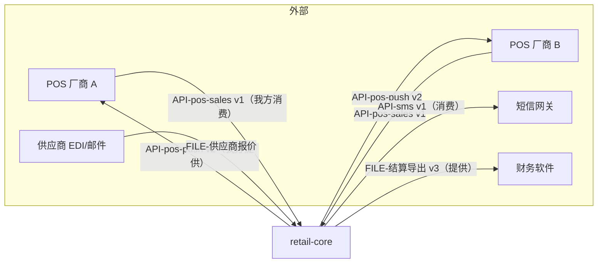

# 系统全景

## 1. 一句话

`retail-core` 是这家连锁超市的唯一商品与经营数据源：总部在这里维护档案、价格、采购、结算，门店在这里管库存与盘点，POS 只做终端。**不做** POS 软件、电商、总账、多租户。

## 2. 上下文图



每条边的契约 ID 在 `contracts/README.md`；我方是消费方的边适用"读只引用不复制、写只在声明窗口内、失败入待补偿"。

## 3. 模块清单

| 模块 | 一句话职责 | 层 | 部署单元 | 负责人 | 状态 | 文档 |
|---|---|---|---|---|---|---|
| platform | 认证、审计日志、配置、消息总线封装、幂等回执 | platform | core | Zhao | active | modules/platform.md |
| identity | 组织、门店、用户、角色、权限 | domain | core | Zhao | active | modules/identity.md |
| catalog | SKU、条码、分类、经营范围、供应商关联 | domain | core | Li | active | [modules/catalog.md](modules/catalog.md) |
| pricing | 门店价、促销规则、价格生效 | domain | core | Li | active | modules/pricing.md |
| supplier | 供应商档案、报价、采购单、到货 | domain | core | Wang | active | modules/supplier.md |
| inventory | 门店库存、批次、盘点、调拨、调整、库存事件 | domain | core | Zhao | active | [modules/inventory.md](modules/inventory.md) |
| member | 会员、积分、等级 | domain | core | Zhou | active | modules/member.md |
| settlement | 供应商结算单、门店日结、对账 | domain | core | Wang | active | modules/settlement.md |
| pos-gateway | POS 推送、流水回传、厂商适配器 | application | **pos-gateway**（独立部署） | Zhao | active | [modules/pos-gateway.md](modules/pos-gateway.md) |
| import-export | 批量导入（两阶段）、模板版本、导出 | application | core | Li | active | [modules/import-export.md](modules/import-export.md) |
| reporting | 报表、事件投影、只读副本 | application | core | Wang | active | modules/reporting.md |
| notification | 站内信、短信、告警投递 | application | core | Zhou | active | modules/notification.md |
| api-gateway | 对外 REST、限流、版本路由 | interface | core | Zhao | active | modules/api-gateway.md |
| admin-web | 后台 Web（React） | interface | admin-web | Zhou | active | modules/admin-web.md |

模块清单与 `services/`、`apps/` 目录的对账：`tools/check_deps.py --list-modules`。

## 4. 分层与依赖方向

```
interface     api-gateway · admin-web
application   pos-gateway · import-export · reporting · notification
domain        identity · catalog · pricing · supplier · inventory · member · settlement
platform      platform
```

**只允许上层依赖下层；同层依赖必须在 `dependency-rules.md` 登记。** 跨模块读数据走所有者 API 或事件投影，不直接查对方的表。`reporting` 例外见 `governance/exceptions.md` EX-004。

## 5. 存储与所有权

一个 PostgreSQL 实例、按模块分 schema（`catalog.*`、`inventory.*` …）；Redis 只作缓存与限流；RabbitMQ 承载全部模块间异步事件。每张表归一个模块，见 `data-ownership.md`。

## 6. 信任边界与运行拓扑

- 两个环境：staging、prod；k3s 各一套；`core` 与 `pos-gateway` 两个部署单元 + `admin-web` 静态托管。
- 边界：POS 厂商只能通过 `pos-gateway` 的公网入口进来（mTLS）；`core` 不暴露公网；供应商文件经人工上传；短信网关凭据只在 `notification` 的密钥引用里。
- agent 的执行边界：本地与 staging 可写（迁移须问），prod 只读。

## 7. 非功能约束

- 可用性：营业时间（07:00–23:00）`pos-gateway` SLO 99.9%；`core` 99.5%。
- 流水回传延迟 P95 ≤ 5 分钟；推送 ≤ 15 分钟。
- 数据保留：流水 3 年；审计日志 1 年；应用日志 90 天。
- 合规：会员手机号脱敏展示；导出含手机号需二次确认与审计。

SLO 定义与告警在各模块文档"可观测性"节；告警阈值的来源是 F-028。

## 8. 相关决策

ADR-0001（模块化单体）、ADR-0007（库存事件 v2）、ADR-0009（幂等回执）、ADR-0012（POS 适配器层与独立部署）。索引见 `../decisions/README.md`。
